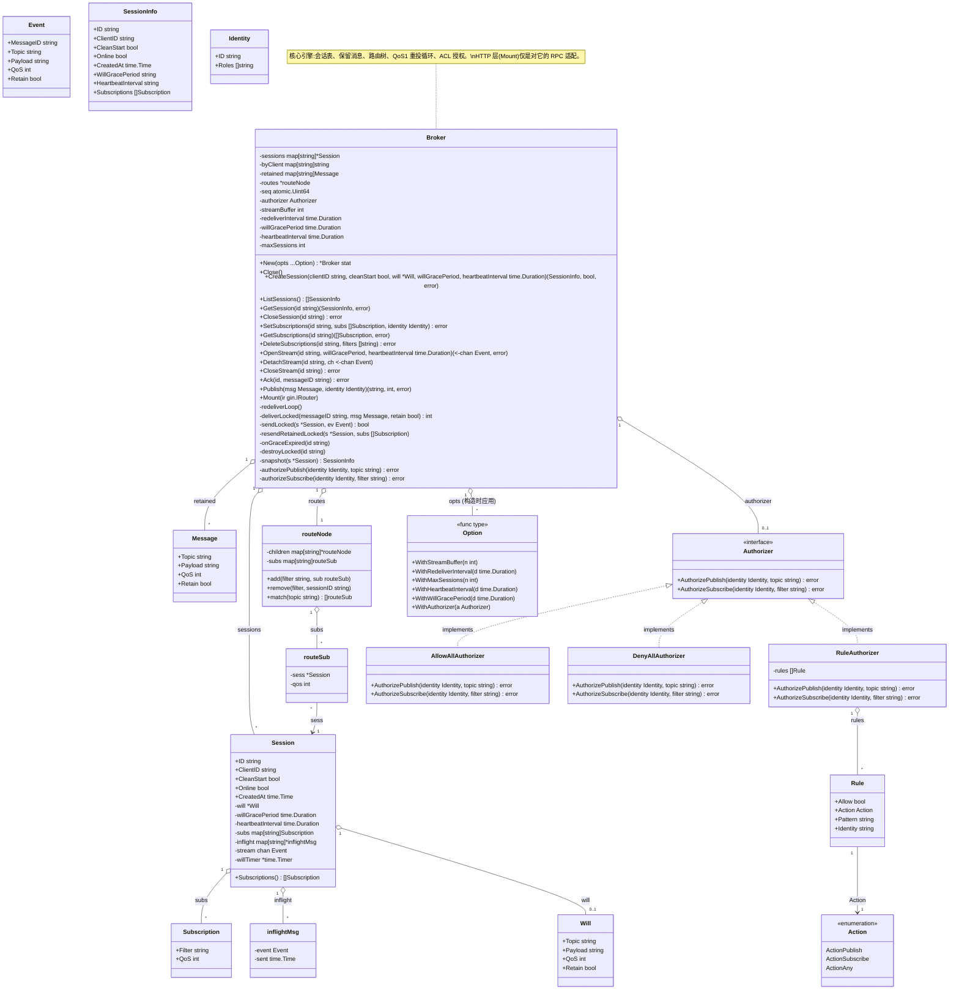

# broker 库结构(类图说明)

本文用 UML 类图描述 `github.com/go4s/broker` 的静态结构。浏览器/GitHub 可直接渲染 ` ```mermaid ` 代码块。

## 总览



## 模块职责

| 文件 | 职责 |
| --- | --- |
| `broker.go` | 核心引擎 `Broker`:会话生命周期、订阅管理、消息发布与投递、QoS1 重投、遗嘱、SSE 流。 |
| `session.go` | `Session` 会话模型与 `Subscription`/`Will`/`inflightMsg` 数据。 |
| `topic.go` | 主题/过滤器校验、`Match`、内部路由树 `routeNode`/`routeSub`。 |
| `acl.go` | 鉴权授权模型:`Identity`、`Authorizer` 接口、`RuleAuthorizer` 及内置实现。 |
| `options.go` | `Option` 函数式配置:缓冲、重投间隔、会话上限等。 |
| `httpapi.go` | gin 适配层:`Mount` 注册路由,身份注入读取,错误到 HTTP 状态码映射。 |
| `example/main.go` | 最小可运行示例:鉴权中间件 + 规则授权器。 |

## 关键关系

- **`Broker` 1 : N `Session`** — 用 `sessions` map 持有全部会话,另有 `byClient`(clientID→sessionID)与 `retained`(保留消息)目录。
- **`Session` 1 : N `Subscription`** — 订阅表 `subs` 独立于推送流;`clean_start=false` 时跨断线保留。
- **`Session` 1 : N `inflightMsg`** — QoS1 已投递未 ACK 消息,由 `redeliverLoop` 周期性重投。
- **`Broker` 1 : 1 `routeNode`** — 主题路由树,发布时 `match(topic)` 收集订阅会话;`routeSub` 反向引用 `Session`。
- **`Broker` 0..1 : 1 `Authorizer`** — 通过 `WithAuthorizer` 注入;取 nil 时 ACL 关闭,发布/订阅一律放行(向后兼容)。
- **`Authorizer` 接口** — `RuleAuthorizer`(规则式,默认拒绝)、`AllowAllAuthorizer`、`DenyAllAuthorizer` 三个实现,接入方也可自行实现。
- **`Option` 构造器模式** — `New(opts ...Option)` 逐项应用到 `Broker`。

## 数据流(时序要点)

1. **创建会话**:`CreateSession` → 生成 `randomID`,建 `Session`;`cleanStart=false` 且同 clientID 存在时复用订阅表(`resumed=true`)。
2. **设置订阅**:`SetSubscriptions` → 校验 filter/QoS → ACL 授权(`authorizeSubscribe`)→ 写 `Session.subs` 与 `routeNode`。
3. **打开流**:`OpenStream` → 建 `stream` channel,置 `Online=true`,补发匹配的保留消息;HTTP 层通过 SSE 消费。
4. **发布**:`Publish` → 校验 topic/QoS → ACL 授权(`authorizePublish`)→ `routeNode.match` 收集在线会话 → `sendLocked` 非阻塞投递(QoS1 记入 in-flight)。
5. **断开**:检测到流关闭 → `DetachStream` 置离线并启动遗嘱宽限期 `willTimer` → 超时 `onGraceExpired` 代发 `Will`,`cleanStart` 会话销毁。
6. **QoS1 确认**:客户端 ACK → `Ack` 删除 in-flight;超时由 `redeliverLoop` 重投。

## HTTP 层(gic 适配)

`Mount(ir gin.IRouter)` 注册以下路由,所有 handler 委托给 `Broker` 方法并做错误 → 状态码映射(`statusOf`):

| 方法 | 路由 | 对应 Broker 方法 |
| --- | --- | --- |
| POST | `/sessions` | `CreateSession` |
| GET | `/sessions`, `/sessions/:id` | `ListSessions`, `GetSession` |
| DELETE | `/sessions/:id` | `CloseSession` |
| PUT/GET/DELETE | `/sessions/:id/subscriptions` | `Set/Get/DeleteSubscriptions` |
| GET/DELETE | `/sessions/:id/stream` | `OpenStream`(SSE)/`CloseStream` |
| POST | `/sessions/:id/acks` | `Ack` |
| POST | `/publish` | `Publish` |

启用 ACL 时,`identityOr401` 从 gin.Context(由接入方中间件经 `SetIdentity` 注入)读取 `Identity`;缺失→401 `ErrUnauthorized`,被 `Authorizer` 拒绝→403 `ErrForbidden`。